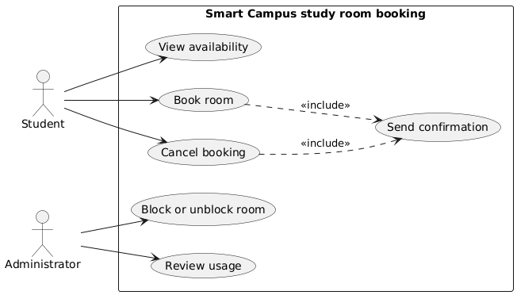

# Lab report — Practice #03, Requirements Engineering with AI

Fill in every section. **Do not delete or renumber the headings** — the README points at them and a
missing heading reads as a missing section.

Name: Karim Aliyev
Student ID: 24B031620
GitHub username: Hevilim

---

## 1. Setup

| | |
| --- | --- |
| AI assistant (tool) | Claude (claude.ai web chat) |
| Exact model name and version | Claude Opus 5.5 |
| Date of the session | 27.09.2026 |
| Diagram renderer used | PlantUML 1.2025.4 (local jar) |

One tool and one model for all three prompts. If you switched, say why here — it changes what your
findings mean.

I used the same tool and the same model for all three prompts. All three prompts were sent in **one
conversation**, not in three fresh chats, so the later answers could see the earlier ones. Before
Prompt 1, I pasted the scenario from README section 1. Before Prompt 2, I pasted the final text of
US-02, US-03 and US-05.

---

## 2. Original AI output — user stories (Part 1)

Paste the **unedited** response to Prompt 1. Do not tidy it. If it is long, paste all of it anyway;
this is the baseline everything else is measured against.

```
Here are user stories for the Smart Campus study room booking system, grouped by actor.

Student

US-1: View room availability
As a Student, I want to see which study rooms are free and when, so that I can plan my study session without going to the library to check.
Priority: High
Assumption: Students are already signed in with their KBTU campus account when they use the application.

US-2: Book a room
As a Student, I want to reserve a free study room for a specific time slot, so that my group and I have a guaranteed place to study.
Priority: High
Assumption: The system enforces the booking rules: the booking starts in the future, lasts no more than two hours, does not overlap another booking, and the room is not blocked.

US-3: Cancel a booking
As a Student, I want to cancel a booking I no longer need, so that the room becomes available to other students.
Priority: High
Assumption: A student can only cancel their own bookings, and only before the booking has started.

US-4: See my bookings
As a Student, I want to see a list of my upcoming bookings, so that I can keep track of when and where my study sessions are.
Priority: Medium
Assumption: The list shows only future bookings, sorted by start time.

US-5: Receive a confirmation
As a Student, I want to receive a confirmation when I book or cancel a room, so that I am sure my request was successful.
Priority: Medium
Assumption: Confirmations are sent to the student's university email address.

Administrator

US-6: Block and unblock rooms
As an Administrator, I want to block a room and unblock it later, so that students cannot book a room that is under maintenance or otherwise unusable.
Priority: High
Assumption: When a room is blocked, any existing future bookings for it are cancelled automatically and the affected students are notified.

US-7: Review room usage
As an Administrator, I want to see how often each room was booked over a chosen period, so that I can decide whether the library needs more or fewer study rooms.
Priority: Medium
Assumption: Usage is calculated from bookings in the system, not from actual attendance.

US-8: Manage the list of rooms
As an Administrator, I want to add, edit and remove study rooms, so that the list of bookable rooms stays accurate.
Priority: Low
Assumption: Each room has a name, a capacity and a location inside the library.

These eight stories cover the student booking flow and the administrator's control and monitoring tasks, and stay within the scenario you described.
```

---

## 3. Story review (Part 2)

One row per change you made. "Kept unchanged" is a valid row and needs a reason too.

| Story (as generated) | What I did | Why | Final ID |
| --- | --- | --- | --- |
| US-1 View room availability | Kept the story, replaced the assumption, changed the reason | "Signed in with a campus account" is authentication, which is out of scope. The new reason ("choose a room and a time before I try to book") is easier to test than "without going to the library". | US-01 |
| US-2 Book a room | Kept the story, replaced the assumption | The assumption only repeated rules R1–R4. A rule is not an assumption. The new assumption says what a time slot is. | US-02 |
| US-3 Cancel a booking | Kept the story, merged US-4 into it, removed "only before the booking has started" | "Only before it started" is a rule the scenario does not have. The student needs to find their own booking to cancel it, so US-4 belongs here. | US-03 |
| US-4 See my bookings | Merged into US-03 | It is not one of the six use cases. Its only real purpose is to find a booking to cancel. | US-03 |
| US-5 Receive a confirmation | Kept the story, rewrote the assumption | It is the only story behind UC-06. "University email" chooses a channel the scenario does not choose. New assumption: one confirmation per booking or cancellation, nothing else. | US-04 |
| US-6 Block and unblock rooms | Rewrote the reason and the assumption | "Under maintenance" is on the out-of-scope list. Automatic cancelling of existing bookings is an invented rule, and "students are notified" is a notification beyond UC-06. | US-05 |
| US-7 Review room usage | Kept the story and the reason, priority Medium → Low, rewrote the assumption | Nothing breaks for students without it, so it is the lowest priority. The old assumption mentioned attendance (out of scope, even as "not from attendance"). "How often" is now "how many hours", which can be tested. | US-06 |
| US-8 Manage the list of rooms | Deleted | Adding, editing and removing rooms is not one of the six use cases. The assistant invented it and still said it stayed within the scenario. | none |

**Did the assistant invent anything outside the scenario?** Yes. Against the out-of-scope list in
README section 1: authentication (US-1 "signed in with their KBTU campus account"), maintenance
(US-6 "under maintenance"), a notification beyond UC-06 (US-6 "affected students are notified") and
attendance (US-7). Outside the six functions: US-4 "See my bookings" and US-8 "Manage the list of
rooms". Invented rules: "only before the booking has started" (US-3) and automatic cancelling on
block (US-6).

**How many stories did you end with, and why that number?** Six: one story for each of the six use
cases. The two extra generated stories (US-4, US-8) did not belong to any use case, so one was merged
and one was deleted. I did not add a story only to reach seven or eight.

---

## 4. Original AI output — acceptance criteria (Part 3)

```
Assumptions
- Times are in local campus time, and "now" means the server time when the request is received.
- A booking of exactly two hours is allowed; anything longer is rejected.
- Two bookings that only touch (one ends at 14:00 and the next starts at 14:00) do not overlap.
- Students are logged in, so the system knows who is making each request.
- A student can only cancel their own bookings.

US-02 — Book room

AC1 (successful booking)
Given Room 101 is not blocked and has no bookings tomorrow between 14:00 and 15:00
When a student books Room 101 for tomorrow 14:00–15:00
Then the booking is saved and a confirmation is sent to the student

AC2 (start in the past)
Given the current time is 10:00
When a student tries to book Room 101 for today 09:00–10:00
Then the booking is rejected with the message "Bookings must start in the future"

AC3 (too long)
Given Room 101 is free tomorrow from 14:00 to 17:00
When a student tries to book Room 101 for tomorrow 14:00–16:30
Then the booking is rejected with the message "A booking cannot be longer than two hours"

AC4 (overlap)
Given Room 101 is already booked tomorrow from 14:00 to 15:00
When another student tries to book Room 101 for tomorrow 14:30–15:30
Then the booking is rejected with the message "This room is already booked for part of that time"

AC5 (blocked room)
Given Room 101 is blocked
When a student tries to book Room 101 for tomorrow 14:00–15:00
Then the booking is rejected and Room 101 is shown as unavailable on the booking screen

US-03 — Cancel booking

AC1 (successful cancellation)
Given a student has a booking for Room 101 tomorrow 14:00–15:00
When the student cancels the booking
Then the booking is deleted from the database and the time slot becomes available to other students

AC2 (someone else's booking)
Given a booking for Room 101 belongs to Student A
When Student B tries to cancel it
Then the request is rejected with the message "You can only cancel your own bookings"

AC3 (booking already started)
Given a student's booking started at 14:00 and the current time is 14:20
When the student tries to cancel it
Then the cancellation is rejected because the booking has already started

AC4 (confirmation)
Given a student has just cancelled a booking
When the cancellation is completed
Then the student receives a cancellation confirmation

US-05 — Block or unblock room

AC1 (block)
Given Room 101 is available
When an administrator blocks Room 101
Then Room 101 is marked as blocked and students can no longer book it

AC2 (unblock)
Given Room 101 is blocked
When an administrator unblocks Room 101
Then Room 101 becomes available for booking again

AC3 (booking a blocked room)
Given Room 101 is blocked
When a student tries to book Room 101
Then the booking is rejected with the message "This room is not available"

AC4 (existing bookings)
Given Room 101 has two future bookings
When an administrator blocks Room 101
Then both bookings are cancelled and the students who made them are notified
```

---

## 5. Criteria review (Part 3)

| Criterion (as generated) | Problem | What I changed it to | Final ID |
| --- | --- | --- | --- |
| Assumption "Students are logged in" | Authentication is out of scope | Removed | — |
| Assumption "server time" | Names an internal component | "The current time of the system" | Assumptions |
| US-02 AC1 successful booking | Two results in one Then (saved + confirmation sent); "saved" is internal; the two-hour boundary was not tested | One result; the booking is exactly 14:00–16:00, so it also tests R2 at the boundary | AC-01 |
| US-02 AC2 start in the past | No problem | Kept, message wording only | AC-02 |
| US-02 AC3 too long | No problem | Kept | AC-03 |
| US-02 AC4 overlap | No problem | Kept | AC-04 |
| US-02 AC5 blocked room | Mentions the "booking screen"; the same case is US-05 AC3 | Merged into the blocked-room criterion of US-05 | AC-11 |
| (missing) touching bookings | The assumption settles it, but no criterion tests it | Added: 14:00–15:00 exists, 15:00–16:00 is created | AC-05 |
| US-03 AC1 successful cancellation | "Deleted from the database" is internal; two results | The result is seen through availability: the slot is shown as free | AC-06 |
| US-03 AC2 someone else's booking | No problem | Kept | AC-07 |
| US-03 AC3 booking already started | Invented rule, not in R1–R4 | Replaced by an invalid case inside the scenario: cancelling the same booking twice | AC-08 |
| US-03 AC4 confirmation | The When is not an action ("the cancellation is completed"); the Given is vague | When the student cancels a concrete booking, Then one confirmation for that booking | AC-09 |
| US-05 AC1 block | Two results; "can no longer book" repeats AC3 | One result, seen through availability | AC-10 |
| US-05 AC2 unblock | "Becomes available" cannot be tested directly | After unblocking, a student books the room and the booking is created | AC-12 |
| US-05 AC3 booking a blocked room | No problem | Kept, message made clearer | AC-11 |
| US-05 AC4 existing bookings | Invented rule (automatic cancelling) and a notification beyond UC-06 | Removed; my assumption says blocking does not change existing bookings | — |

**The two open questions.** Write your decision and the reason. Either answer is accepted.

| Question | My decision | Why |
| --- | --- | --- |
| A booking ending exactly when another begins — overlap under R3? | allowed | A booking is the time from its start up to, not including, its end. 14:00–15:00 and 15:00–16:00 share no minute, so the room is never used twice at once. Tested by AC-05. |
| Is exactly two hours allowed under R2? | allowed | R2 says "at most two hours". "At most" includes the maximum. Tested by AC-01. |

**Which invalid or boundary case did the assistant leave out?** The two boundaries it had settled
itself: exactly two hours (R2) and touching bookings (R3). It wrote them as assumptions but gave no
criterion that tests them. I added AC-01 and AC-05. Still not covered: a booking that starts exactly
"now" (the R1 boundary) and blocking a room that is already blocked.

---

## 6. Original AI output — use-case diagram (Part 4)

```
@startuml
left to right direction
skinparam packageStyle rectangle

actor Student
actor Administrator

rectangle "Smart Campus Study Room Booking System" {
  usecase "View availability" as UC1
  usecase "Book room" as UC2
  usecase "Cancel booking" as UC3
  usecase "Block or unblock room" as UC4
  usecase "Review usage" as UC5
  usecase "Send confirmation" as UC6
}

Student --> UC1
Student --> UC2
Student --> UC3
Student --> UC6

Administrator --> UC1
Administrator --> UC4
Administrator --> UC5

UC2 ..> UC1 : <<include>>
UC2 ..> UC6 : <<include>>
UC3 ..> UC6 : <<include>>
@enduml
```

Rendered diagram (image, or a link):

Final (reviewed) diagram: `requirements/use-cases.png`, rendered locally with PlantUML 1.2025.4.



---

## 7. Diagram review (Part 4)

| Element | Problem | What I changed |
| --- | --- | --- |
| `Student --> UC6` (Send confirmation) | No person triggers Send confirmation. The system starts it after a booking or a cancellation. | Removed. UC-06 is reached only through the two includes. |
| `Administrator --> UC1` (View availability) | No story gives the Administrator this goal, and the scenario does not need it for blocking or usage. | Removed. |
| `UC2 ..> UC1 : <<include>>` | Include means Book room always runs View availability. That is not true: the overlap check (R3) is part of Book room itself. | Removed. |
| `UC2 ..> UC6`, `UC3 ..> UC6` include | Correct: every booking and every cancellation sends a confirmation (UC-06). | Kept. |
| Aliases `UC1`…`UC6` | Do not match the `UC-nn` IDs | Renamed to `UC01`…`UC06` |
| `skinparam packageStyle rectangle` | Not needed, the boundary is already a rectangle | Removed |
| Actors, boundary, use-case names | Both actors are outside the boundary, no third actor, every name is verb + goal | Kept |

**Associations.** Which actor–use-case links did the assistant draw that a person does not actually
trigger? Name them. Student → Send confirmation: the system triggers it, not the student. I also
removed Administrator → View availability, because no story stands behind it. Review usage was
connected correctly, only to the Administrator. When I ran `check_requirements.py` on the generated
diagram, PU-6 failed on exactly this link: "Student → Send confirmation (no person triggers it; the
system does)".

**Did any screen, database or internal component appear as a use case or an actor?** No, not in the
diagram. In the criteria, yes: "booking screen" (US-02 AC5), "database" (US-03 AC1) and "server
time" (assumptions). All three were removed.

---

## 8. Traceability (Part 5)

Summarise what the table in `requirements/traceability.md` shows:

- Use cases with **no story** behind them: none. Every use case has one story. Use cases with **no
  criteria**: UC-01 View availability and UC-05 Review usage. UC-06 is only partly tested (AC-09
  tests the cancellation confirmation; the booking confirmation is not tested).
- Stories with **no use case** they belong to: none in the final set. In the generated set, US-4
  "See my bookings" and US-8 "Manage the list of rooms" had none.
- Criteria that test **no rule** from section 1: AC-06, AC-07, AC-08, AC-09, AC-10. They test the
  behaviour of UC-03 and UC-04, not R1–R4.

**What does the largest gap tell you about the generated requirements?** The criteria are strong only
where a business rule exists. Booking has four rules and got seven criteria. View availability and
Review usage have no rules and no criteria. Where the scenario has no rule, the assistant either wrote
nothing (UC-01, UC-05) or invented a rule (cancel only before start, automatic cancel on block). So
the generated requirements follow the rules, not the users' goals.

---

## 9. Checker runs

Paste the **real terminal output** of both runs. A table with nothing behind it does not count.

```
hevilim@MacBook-Pro-Karim week-03 % python3 tests/check_requirements.py
PASS   US-1  user-stories.md         no placeholders left
PASS   US-2  user-stories.md         6 stories, IDs US-01…US-06
PASS   US-3  user-stories.md         every story has the required sentence shape
PASS   US-4  user-stories.md         every story has a priority
PASS   US-5  user-stories.md         every story declares an assumption
PASS   US-6  user-stories.md         only Student and Administrator appear as roles
PASS   US-7  user-stories.md         nothing from the out-of-scope list appears
PASS   AC-1  acceptance-criteria.md  no placeholders left
PASS   AC-2  acceptance-criteria.md  three sections, all naming real stories: US-02, US-03, US-05
PASS   AC-3  acceptance-criteria.md  every section has 3 to 5 uniquely numbered criteria
PASS   AC-4  acceptance-criteria.md  all 12 criteria are complete Given/When/Then
PASS   AC-5  acceptance-criteria.md  every section covers an invalid or boundary case
PASS   AC-6  acceptance-criteria.md  5 assumptions listed before the criteria
PASS   AC-7  acceptance-criteria.md  both open questions are settled in the assumptions
PASS   PU-1  use-cases.puml          valid PlantUML block, no placeholders
PASS   PU-2  use-cases.puml          exactly two actors: Student, Administrator
PASS   PU-3  use-cases.puml          all six use cases present
PASS   PU-4  use-cases.puml          system boundary present
PASS   PU-5  use-cases.puml          no screens, databases or internal components
PASS   PU-6  use-cases.puml          no unjustified actor associations found
PASS   TR-1  traceability.md         all six use cases have a row
PASS   TR-2  traceability.md         every ID in the table resolves
PASS   TR-3  traceability.md         every story appears in the table
------------------------------------------------------------------------
23 PASS · 0 FAIL · 0 ERROR   (23 checks)
Shape is clean. This says nothing about whether the requirements are good.
```

```
hevilim@MacBook-Pro-Karim week-03 % python3 tests/validate_submission.py
submission.yml — submission.yml
------------------------------------------------------------------------
PASS   schema                                    1
PASS   week                                      03
PASS   student.name                              Karim Aliyev
PASS   student.student_id                        24B031620
PASS   student.github                            Hevilim
PASS   assistant.tool                            Claude (claude.ai)
PASS   assistant.model                           Claude Opus 5.5
PASS   counts.user_stories                       6
PASS   counts.acceptance_criteria_sets           3
PASS   checker                                   23 PASS · 0 FAIL · 0 ERROR
NOTE   checker                                   you are claiming a clean run — it will be re-run at your commit, so make sure it is true
PASS   checker.commit                            b80087b
PASS   assumptions.overlap_touching_bookings     allowed
PASS   assumptions.exactly_two_hours             allowed
PASS   traceability.use_cases_not_covered        UC-01, UC-05
PASS   traceability.stories_not_traced           []
PASS   review_findings                           6 findings
PASS   review_findings[1]                        UC-06 Send confirmation was linked to Student in the generat…
PASS   review_findings[2]                        US-05 as generated said rooms are blocked for maintenance an…
PASS   review_findings[3]                        US-01 as generated assumed students are signed in with a cam…
PASS   review_findings[4]                        US-03 absorbed the generated story See my bookings, and the …
PASS   review_findings[5]                        AC-01 and AC-05 were added because the generated criteria se…
PASS   review_findings[6]                        UC-01 and UC-05 have stories (US-01, US-06) but no acceptanc…
PASS   honesty.can_explain_everything_submitted  yes
PASS   honesty.ai_usage_disclosed                yes
------------------------------------------------------------------------
24 PASS · 0 FAIL · 0 ERROR · 1 note
Shape is fine. This says nothing about whether the work is good.
```

| | PASS | FAIL | ERROR |
| --- | --- | --- | --- |
| `check_requirements.py` | 23 | 0 | 0 |

Commit these numbers were produced at (`git rev-parse --short HEAD`): b80087b

**Every FAIL, one line each: what it is and what you decided to do about it.** A FAIL you report and
explain costs you nothing.

The final run has no FAIL. Before the review, the generated diagram gave one FAIL: PU-6, Student →
Send confirmation. I agreed with it and removed the link (section 7).

**Did you run the checks by hand instead of with Python?** No. Both checkers were run with Python 3.

---

1. The worst part was not a missing thing, it was an extra thing. The assistant added a story called "Manage the list of rooms" and then told me it had stayed inside the scenario. That surprised me. It also made up two rules on its own: you can cancel only before the booking starts, and blocking a room cancels all its bookings. In the diagram it connected Student to Send confirmation (UC-06), but a student never starts that, the system does. Without a checker, I would just go slowly: take each story and each arrow and ask "which of the six use cases is this?" and "is this on the out-of-scope list?".

2. The criteria for Book room. AC-02, AC-03 and AC-04 came with real times and clear error messages, and I only changed a few words. That saved me a lot of time.

3. US-03 Cancel booking. The scenario says nothing about when you can cancel, and the AI filled that gap with its own rule. If I am not in the room, a developer will ask me: "Can I cancel a booking that already started?" Right now, AC-06 to AC-09 do not answer that.
